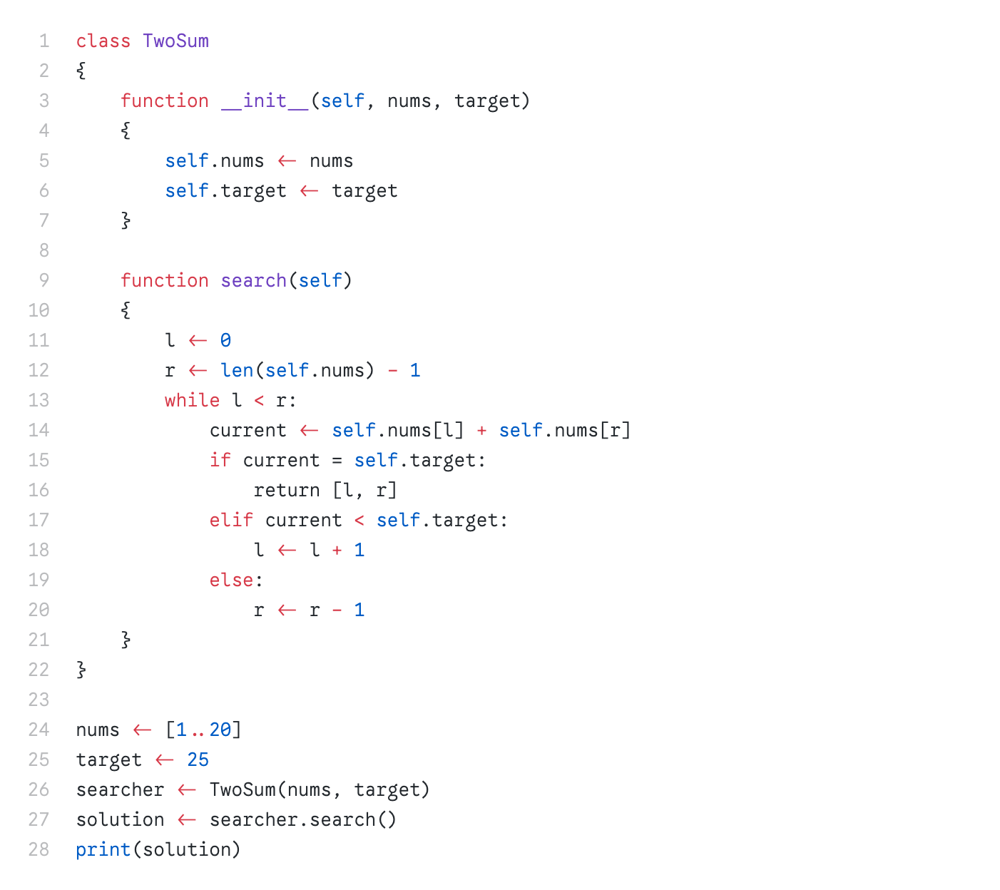

**HolyPython.** *Python as God intended.*

<center>

| Python              | HolyPython             | Note                             |
|---------------------|------------------------|----------------------------------|
| `a == b`            | `a = b`                |                                  |
| `a = b`             | `a <- b`               |                                  |
| `[a, ..., b]`       | `[a..b]`               | `a`, `b` non-decreasing integers |
| `def f(): ...`      | `function f() { ... }` |                                  |
| `class C: ...`      | `class C { ... }`      |                                  |

</center>

### Preview

<center></center>

### How to compile

**Standard**

```sh
python holypython.py foo.hpy
```

**`uv`**

```sh
uv run python holypython.py foo.hpy
```

### How to enable syntax highlighting

**VSCode**

1. Create extension:

   ```sh
   cd packages/vscode
   npx --yes @vscode/vsce package
   ```

2. Install extension:

   ```sh
   code --install-extension holypython-0.0.1.vsix
   ```
