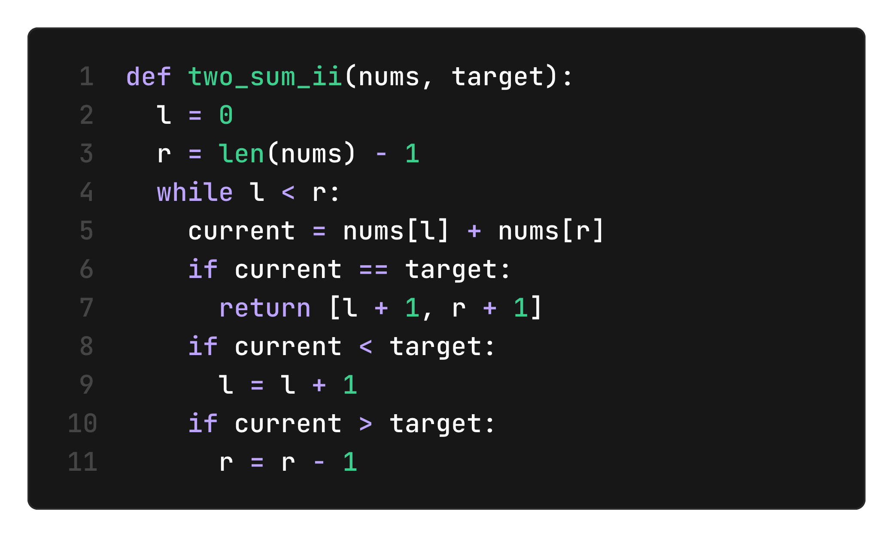
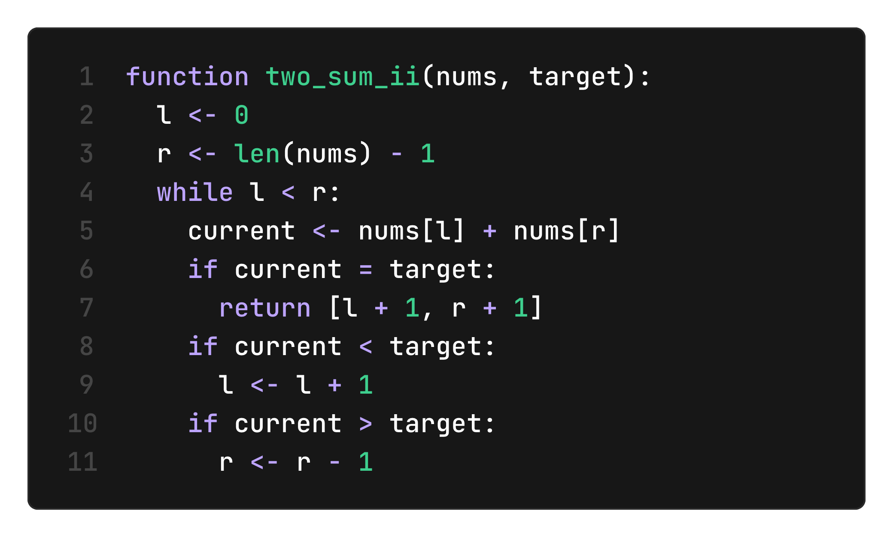

# 🐍 SnekScript

SnekScript is a Python dialect that compiles to Python.

<table>
	<tr>
		<td></td>
		<td></td>
	</tr>
</table>

## Boarding

To install the SnekScript compiler on Linux or MacOS, run:
```bash
install ssc /usr/local/bin
```

To uninstall the SnekScript compiler on Linux or MacOS, run:
```sh
rm /usr/local/bin/ssc
```

## Syntax

| Idea                | Python   | SnekScript |
|---------------------|----------|------------|
| Equality check      | `a == b` | `a = b`    |
| Variable assignment | `a = b`  | `a <- b`   |
| Function definition | `def`    | `function` |

## Usage

To compile `file.ss` to `file.py`, run:
```sh
ssc file.ss
```

To enable syntax highlighting in VS Code, run:
```sh
cd extensions/vscode

# Build extension
npx @vscode/vsce package --out snekscript.vsix

# Install extension
code --install-extension snekscript.vsix
```
